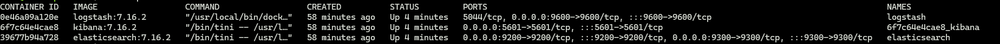
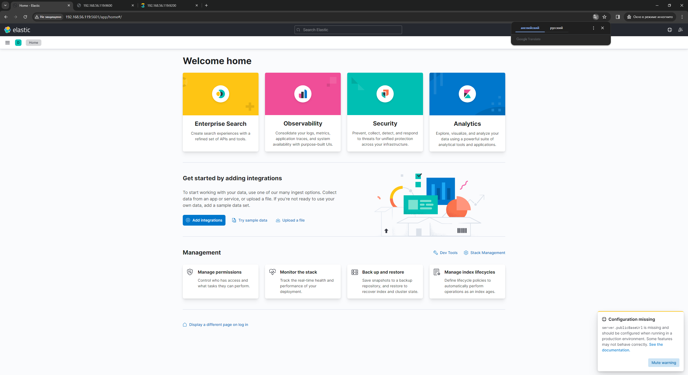

# ELK_docker-compose

## My test install stack ELK with docker-compose

## To successfully start ELK, follow the steps below :

### Download the repository

```
git clone https://github.com/deniskin1998/ELK_docker-compose.git
```

### Go to the elk folder

```
cd elk
```

### Change the file logstash.conf.txt

```
mv logstash.conf.txt logstatsh.conf
```

### Run docker-compose

```
docker-compose up -d
```

### Checking that all the containers are run

```
docker ps
```



### Open browser ip_address:5601 for Kibana


